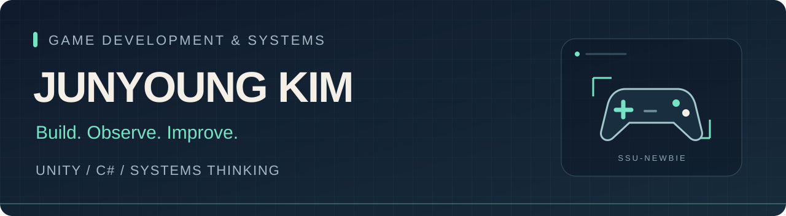

  

  <strong>게임 시스템을 만들고, 동작을 끝까지 확인합니다.</strong> 
  김준영 · 숭실대학교 컴퓨터학부 · Unity / C#

  <a href="#selected-work">프로젝트</a> ·
  <a href="#toolbox">기술 경험</a> ·
  <a href="#how-i-work">개발 방식</a>

---

안녕하세요, **김준영**입니다. Unity와 C#을 중심으로 게임 개발 경험을 쌓고 있습니다.
게임 모드의 기능과 밸런스를 기획하고, 실행 로그와 재현 실험으로 문제를 추적하며, 외부 배포까지 이어가는 과정에 관심이 있습니다.

이곳에는 게임 개발 경험과 공개 소스에서 확인할 수 있는 프로젝트를 정리합니다.

## Selected Work

### 01 · 세피리아 모드 제작

**게임의 내부 동작을 분석하고, 원하는 플레이 경험으로 확장하기**

Unity 기반 게임의 모드를 기획·개발하고 외부 배포까지 진행했습니다.
원본 소스가 공개되지 않은 환경에서 IL 분석과 실행 로그를 활용해 동작을 파악했습니다.

- **기능 설계:** 변경할 게임 기능과 밸런스의 요구사항 정의
- **문제 분석:** 3인 이상 파티에서 적 수가 고정되는 현상을 재현하고, 조건 분기의 우선순위 문제와 수정 방향 분석
- **검증 과정:** AI 도구와 협업하며 빌드 실행, 로그 수집, 가설 검증을 반복

`C#` `Unity` `BepInEx` `HarmonyX` `Mono.Cecil`

[개발 경험 자세히 보기 →](./projects/sephiria-mods.md)

### 02 · PancakE Survey Server

**플레이어의 설문 응답이 다음 플레이의 주민 데이터가 되는 게임 서버**

설문 응답을 저장하고 최근 응답자를 게임에 전달하는 FastAPI 서버입니다.
점수 등록과 최고 점수 조회를 함께 제공하며, 작은 프로젝트의 데이터 흐름을 직접 살펴볼 수 있습니다.

- **데이터 순환:** 설문 제출 → 응답 저장 → 최근 주민 데이터 조회
- **기록 관리:** 점수 저장 및 최고 점수 반환
- **구현 포인트:** Pydantic 요청 모델, JSON 파일 저장, 프로세스 내부 잠금과 임시 파일 교체

`Python` `FastAPI` `Pydantic` `Uvicorn`

[소스 코드 →](https://github.com/ssu-newbie/pancake-server) · [API 구현 →](https://github.com/ssu-newbie/pancake-server/blob/main/pancake_server.py)

## Toolbox

| 분야 | 사용 경험 |
| --- | --- |
| 게임 개발 | Unity, C#, .NET / Mono |
| 모드 분석·확장 | BepInEx, HarmonyX, Mono.Cecil, Unity IMGUI |
| 게임 지원 서버 | Python, FastAPI, JSON 기반 데이터 저장 |
| 개발·검증 | Git / GitHub, 실행 로그 분석, 재현 실험 |
| 전공 실습 | C, xv6 시스템콜·스케줄러 구현 |

## How I Work

1. **기대 동작을 먼저 정합니다.** 구현할 기능과 확인할 조건을 구체적으로 적습니다.
2. **실행 결과로 판단합니다.** 로그와 재현 절차를 남기고, 가설이 실제 동작과 맞는지 확인합니다.
3. **과정을 설명할 수 있게 남깁니다.** 구현 의도, 발견한 문제, 검증 결과를 다음 작업에 연결합니다.

---

Build. Observe. Improve.

